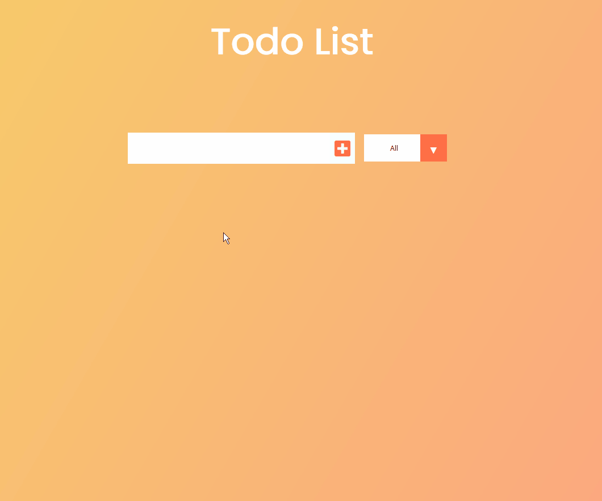

# Todo React APP

This project was bootstrapped with [Create React App](https://github.com/facebook/create-react-app).

## Available Scripts

In the project directory, you can run:

#### `yarn start or npm start`

Runs the app in the development mode.\
Open [http://localhost:3000](http://localhost:3000) to view it in the browser.

The page will reload if you make edits.\
You will also see any lint errors in the console.

<h3> Preview:</h3>

 
<h4> Online <a href="https://todo-reactapp9.herokuapp.com/">here</a></h4>

